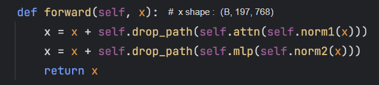

# python 中的 ` * ` 和`**`
## 函数定义时 
* `def func(*pramas)`
* `*`是收集位置参数到元组()中
* `**`是收集关键字参数到字典{}中
* def fun(a,`*`,b)时，b必须用关键字方式`b=4`传入
## 函数调用和赋值时
* `func(**{'a':1,'b'：2})`
* *表示分配元组(a,b,c)中的参数
* **表示分配字典 {a:1,b:2} 中的参数

# transformer 的encoder block应该这样看

## 1.norm + attention +res  2.mlp + res残差

# pytorch tensor的存储
## 逻辑存储与物理存储
* 在逻辑层面是多维的
* 在物理层面始终是一维的
* pytorch是行优先存储的，matlab是列优先存储的
## Contiguous的含义

## view reshape 和permute
* view
  * 视图，本质改变了shape属性和stride属性。物理存储未发生变化
* reshape
  * 对于contiguous：等价于view
  * 对于incontiguous:先调用contiguous()生成新的连续拷贝再view
* permute 
  * 修改stride 和shape属性，但是不能保证contiguous

# VS code launch和task
## task json
* 指示编译文件
## launch json
* 指示调试和传参运行文件
## 常用变量
* args：配置的参数
* ${file}:当前活动文件
* ${fileBasename}:当前运行文件名

# 各种归一化方法
* (x-min)/(max-min) 

## BN
* bn需要的batch_size很大，消耗内存

* 一堆书的同一页 计算
## LN

## I(instance)N

## G(group)N

## 总结

# 推理

# python 常见概念

* string set list tuple dict 是容器也可视为可迭代对象 
使用iter 可以返回迭代器对象

# 分析Deformable detr小目标精度的提升
* 多尺度特征对于提升精度还有小目标的检测是十分有用的
* 普通transformer本身的计算复杂度限制了`src sequences`的长度
* 减少了transformer核心模块attention的计算复杂度，是的加`使用了多尺度特征`到`src sequences`成为了可能

# segmentation 
* 聚类和分类

* thing(可分) stuff（不可分）
* semantic segmentation 逐像素的分类（全都视为了stuff）
* instance segmentation 在detection的基础上 更细致分割出不同的thing
* panoptic segmentation 在semantic segmentation基础上对thing区分
# detection
* 目标定位和目标分类

